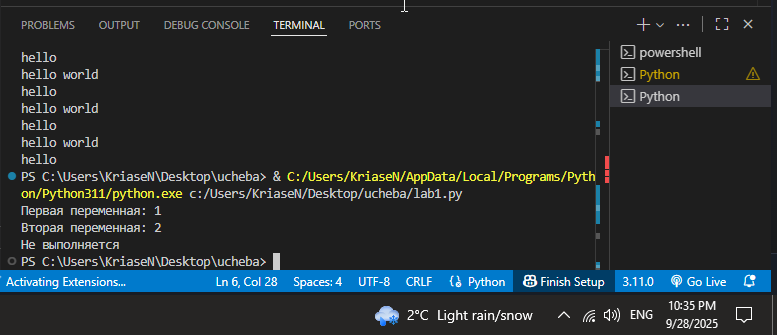
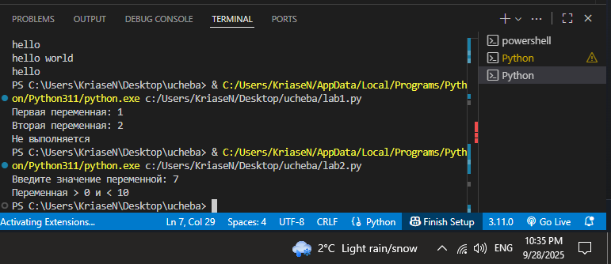
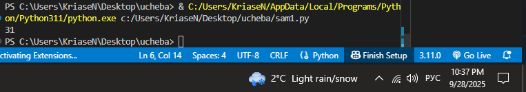
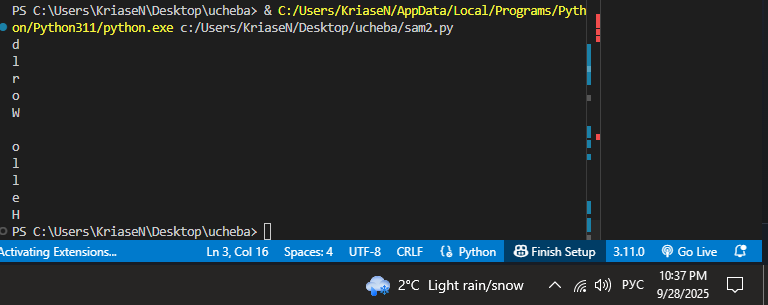
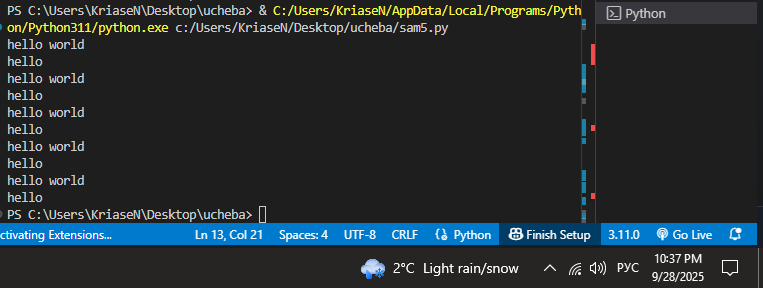

# Тема 2. Базовые операции языка Python
Отчет по Теме #2 выполнил(а):
- Носов Никита Дмитриевич
- ИВТ-23-2

| Задание | Лаб_раб | Сам_раб |
| ------ | ------ | ------ |
| Задание 1 | + | + |
| Задание 2 | + | + |
| Задание 3 | + | + |
| Задание 4 | + | + |
| Задание 5 | + | + |
| Задание 6 | + | + |
| Задание 7 | + | + |
| Задание 8 | + | + |
| Задание 9 | + | + |
| Задание 10 | + | + |

знак "+" - задание выполнено; знак "-" - задание не выполнено;

Работу проверили:
- к.э.н., доцент Панов М.А.

## Лабораторная работа №1
### Выведите в консоль три строки. Первая – любое число. Вторая – любое число в виде строки. Третья – любое число с плавающей точкой.

```python
print(123)
print('123')
print(1.23)
```
### Результат.


## Выводы

В этом коде выводятся три значения разного типа: целое число, строка и число с плавающей точкой. Функция `print()` обеспечивает отображение каждого значения в отдельной строке.

## Лабораторная работа №2
### Выведите в консоль три строки. Первая – результат сложения или вычитания минимум двух переменных типа int. Вторая – результат сложения или вычитания минимум двух переменных типа float. Третья – результат сложения или вычитания минимум двух переменных типа int и float.

```python
print(123 + 351)
print(12.3 - 3.21)
print(10 + 26.655 + 1 + 3.66)
```
### Результат.


## Выводы

Код демонстрирует выполнение арифметических операций: сложение и вычитание для целых чисел и чисел с плавающей точкой. Результат зависит от типа данных: при участии float итог также будет float.

## Лабораторная работа №3
### Выведите в консоль три строки. Первая – обычная строка. Вторая – F строка с использованием заранее объявленной переменной. Третья – сложите две или более строк в одну.

```python
print('Hello World!')

world = 'World'
print(f"Hello {world}!")

one = 'Hello'
two = ' '
three = 'World!'
print(one + two + three)
```
### Результат.


## Выводы

Показаны три способа работы со строками: обычная строка, F-строка с переменной и объединение нескольких строк в одну. Все варианты выводятся с помощью `print()`.

## Лабораторная работа №4
### Выведите в консоль три строки. Первая – трансформация любого типа переменной в bool. Вторая – трансформация любого типа переменной в float или int. Третья – трансформация любого типа переменной в str.

```python
one = 'some string'
print(bool(one))

two = 324
print(float(two))

three = 45.3
print(str(three))
```
### Результат.


## Выводы

Код иллюстрирует преобразование типов: строка → bool, целое число → float, число с плавающей точкой → строка. Функция `print()` отображает результат каждого преобразования.

## Лабораторная работа №5
### Присвойте трем переменным различные значения, воспользовавшись функцией input().

```python
one = input('one: ')
two = input('two: ')
three = input('three: ')
print(one, two, three)
```
### Результат.


## Выводы

Переменные получают значения через пользовательский ввод с клавиатуры. Все введённые данные выводятся на экран с помощью `print()`.

## Лабораторная работа №6
### Создайте две любые числовые переменные и выполните над ними несколько математических операций: возведение в степень, обычное деление, целочисленное деление, нахождение остатка от деления. При желании вы можете проверить как работают эти вычисления с разными типами данных, например, сначала создать две переменные int, затем создать две переменные float и наконец создать переменные типа int и float и провести над ними операции, прописанные выше.

```python
one = 12
two = 5
print('Возведение в степень:', one ** two)
print('Обычное деление:', one / two)
print('Целочисленное деление:', one // two)
print('Нахождение остатка от деления:', one % two)
```
### Результат.


## Выводы

Демонстрируются различные математические операции над числами. Результаты операций выводятся на экран.

## Лабораторная работа №7
### Создайте любую строковую переменную и произведите над ней математическое действие умножение на любое число.

```python
line = 'hello'
print(line*27895)
```
### Результат.


## Выводы

Строка умножается на число, в результате чего она повторяется указанное количество раз и выводится на экран.

## Лабораторная работа №8
### Посчитайте сколько раз символ ‘o’ встречается в строке ‘Hello World’.

```python
line = 'aaaabcasd'
print(line.count('a'))
```
### Результат.


## Выводы

С помощью метода `count()` подсчитывается количество вхождений символа в строку. В данном случае результат равен 2.

## Лабораторная работа №9
### Напишите предложение ‘Hello World’ в две строки. Написанная программа должна занимать одну строку в редакторе кода.

```python
print("Hello\nWorld")
```
### Результат.


## Выводы

Символ переноса строки `\n` позволяет вывести текст на две строки: `'Hello'` и `'World'`.

## Лабораторная работа №10
### Из предложения ‘Hello World’ выведите в консоль только 2 символ, а затем выведите слово ‘Hello’

```python
line = "Hello World"
print(line[1])
print(line[:5])
```
### Результат.


## Выводы

Выводятся отдельные символы и срез строки с помощью индексации: второй символ и первые пять символов.

## Самостоятельная работа №1
### Выведите в консоль булевую переменную False, не используя слово False в строке или изначально присвоенную булевую переменную. Программа должна занимать не более двух строк редактора кода.

```python
print(1 == 2)
```
### Результат.


## Выводы

Сравниваются два числа. Поскольку 1 не равно 2, результат равен `False`.

## Самостоятельная работа №2
### Присвоить значения трем переменным и вывести их в консоль, используя только две строки редактора кода

```python
a,b,c = 1,2,3
print(a,b,c)
```
### Результат.


## Выводы

Трем переменным присваивается значение, которое затем выводится на экран.
## Самостоятельная работа №3
### Реализуйте ввод данных в программу, через консоль, в виде только целых чисел (тип данных int). То есть при вводе буквенных символов в консоль, программа не должна работать. Программа должна занимать не более двух строк редактора кода. 

```python
user_input = int(input())
print(user_input)
```
### Результат.


## Выводы

Пользователь вводит число, которое преобразуется в `int`. Если ввод некорректный, будет ошибка.

## Самостоятельная работа №4
### Создайте только одну строковую переменную. Длина строки должна не превышать 5 символов. На выходе мы должны получить строку длиной не менее 16 символов. Программа должна занимать не более двух строк редактора кода.

```python
line = 'abcd'
print(line * 24)
```
### Результат.


## Выводы

Строка умножается на число, чтобы увеличить её длину.

## Самостоятельная работа №5
### Создайте три переменные: день (тип данных - числовой), месяц (тип данных - строка), год (тип данных - числовой) и выведите в консоль текущую дату в формате: “Сегодня день месяц год. Всего хорошего!” используя F строку и оператор end внутри print(), в котором вы должны написать фразу “Всего хорошего!”. Программа должна занимать не более двух строк редактора кода.

```python
day, month, year = 13,'сентября',2025
print(f"Сегодня {day}  {month}  {year}. ", end = 'Всего хорошего!')
```
### Результат.


## Выводы

С помощью F-строки формируется дата, а `end` добавляет строку в конец вывода без переноса.

## Самостоятельная работа №6
### В предложении ‘Hello World’ вставьте ‘my’ между двумя словами. Выведите полученное предложение в консоль в одну строку. Программа должна занимать не более двух строк редактора кода. 

```python
hello_world = "Hello World"
print(hello_world[:5],'my', hello_world[6:])
```
### Результат.


## Выводы

Слово `'my'` вставляется между двумя словами исходной строки с помощью срезов и объединения.

## Самостоятельная работа №7
### Узнайте длину предложения ‘Hello World’, результат выведите в консоль. Программа должна занимать не более двух строк редактора кода.

```python
print(len("Hello world"))
```
### Результат.


## Выводы

Функция `len()` возвращает количество символов в строке.

## Самостоятельная работа №8
### Переведите предложение ‘HELLO WORLD’ в нижний регистр. Программа должна занимать не более двух строк редактора кода.

```python
print("HELLO WORLD".lower())
```
### Результат.


## Выводы

В данном коде строка 'HELLO WORLD' переводится в нижний регистр функцией `lower()`. Полученный результат преобразования выводится в консоль функцией `print()`.

## Самостоятельная работа №9
### Самостоятельно придумайте задачу по проходимой теме и решите ее. Задача должна быть связанна со взаимодействием с числовыми значениями. Задача: на ввод дается число, вывести квадрат числа.

```python
n = int(input("Введите число: "))
print("Квадрат числа =", n**2)
```
### Результат.


## Выводы

Метод `lower()` переводит строку в нижний регистр.

## Самостоятельная работа №10
### Самостоятельно придумайте задачу по проходимой теме и решите ее. Задача должна быть связанна со взаимодействием со строковыми значениями. Задача: На ввод дается строчка, вывести ее в верхнем регистре

```python
s = input("Введите строку: ")
print(s.upper())
```
### Результат.


## Выводы

Введённая строка преобразуется в верхний регистр методом `upper()`.

## Общие выводы по теме
В работе изучены базовые операции Python: арифметика с числами, работа со строками, преобразование типов и ввод данных. Особое внимание уделено F-строкам и параметрам функции `print()` (`sep`, `end`, `file`, `flush`), которые повышают гибкость вывода.