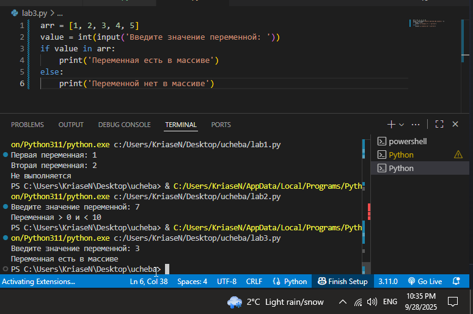
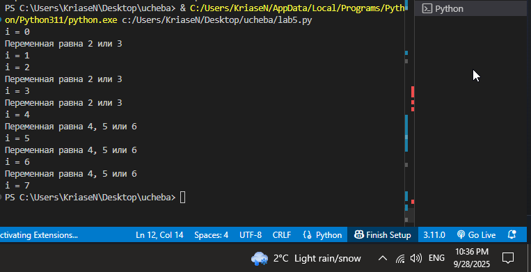
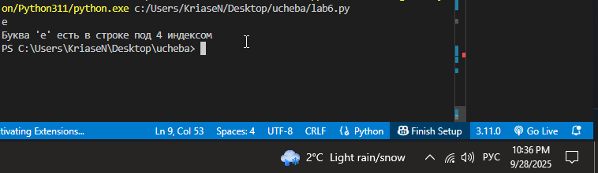
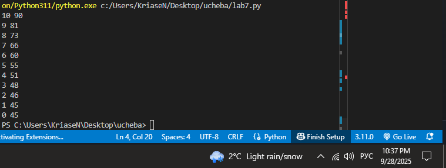
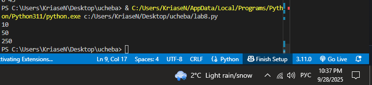

# Тема 3. Операторы, условия, циклы

Отчет по Теме #3 выполнил(а):

-  Носов Никита Дмитриевич
    
-   ИВТ-23-2
    


| Задание | Лаб_раб | Сам_раб |
| ------ | ------ | ------ |
| Задание 1 | + | + |
| Задание 2 | + | + |
| Задание 3 | + | + |
| Задание 4 | + | + |
| Задание 5 | + | + |
| Задание 6 | + |  |
| Задание 7 | + |  |
| Задание 8 | + |  |
| Задание 9 | + |  |
| Задание 10 | + |  |

знак "+" - задание выполнено; знак "-" - задание не выполнено;

Работу проверили:

-   к.э.н., доцент Панов М.А.
    

----------

## Лабораторная работа №1

### Создайте две переменные, значение которых будете вводить через консоль. Также составьте условие, в котором созданные ранее переменные будут сравниваться, если условие выполняется, то выведете в консоль «Выполняется», если нет, то «Не выполняется».


```Python
one = int(input('Первая переменная: '))
two = int(input('Вторая переменная: '))
if one >= two:
    print('Выполняется')
else:
    print('Не выполняется')
```

### Результат.


## Выводы

Код сравнивает две переменные, введенные пользователем. Используя конструкцию **`if/else`**, выводится `"Выполняется"`, если первая переменная **больше или равна** второй, и `"Не выполняется"` в противном случае.

----------

## Лабораторная работа №2

### Напишите программу, которая будет определять значения переменной меньше 0, больше 0 и меньше 10 или больше 10. Это нужно реализовать при помощи одной переменной, значение которой будет вводится через консоль, а также при помощи конструкций if, elif, else.


```Python
one = int(input('Введите значение переменной: '))
if one < 0:
    print('Переменная < 0')
elif 0 < one < 10:
    print('Переменная > 0 и < 10')
else:
    print('Переменная > 10')
```

### Результат.


## Выводы

Программа с помощью конструкций **`if`**, **`elif`** и **`else`** определяет, находится ли переменная, введенная пользователем, в одном из трех диапазонов: меньше 0, между 0 и 10 (не включая границы), или больше/равно 10.

----------

## Лабораторная работа №3

### Напишите программу, в которой будет проверяться есть ли переменная в указанном массиве используя логический оператор in. Самостоятельно посмотрите, как работает программа со значениями которых нет в массиве numbers.


```Python
arr = [1, 2, 3, 4, 5]
value = int(input('Введите значение переменной: '))
if value in arr:
    print('Переменная есть в массиве')
else:
    print('Переменной нет в массиве')
```

### Результат.


## Выводы

Введенное пользователем значение проверяется на наличие в массиве **`arr`** с использованием логического оператора **`in`**. В зависимости от результата проверки выводится соответствующее сообщение о наличии или отсутствии переменной в списке.

----------

## Лабораторная работа №4

### Напишите программу, которая будет определять находится ли переменная в указанном массиве и если да, то проверьте четная она или нет. Самостоятельно протестируйте данную программу с разными значениями переменной value.


```Python
arr = [1, 2, 3, 4, 5, 6, 7]
value = int(input('Введите значение переменной: '))
if value in arr:
    if value % 2 == 0:
        print('Переменная есть в массиве и она четная')
    else:
        print('Переменная есть в массиве и она нечетная')
else:
    print(f"Переменной нет в массиве и она равна {value}")
```

### Результат.


## Выводы

Код сначала проверяет наличие переменной в массиве **`arr`**. Если она найдена, с помощью **вложенного условия** **`if/else`** определяется ее четность (проверка остатка от деления на 2: `value % 2 == 0`) и выводится соответствующее сообщение. Если переменной нет в массиве, выводится сообщение о ее отсутствии и текущем значении.

----------

## Лабораторная работа №5

### Напишите программу, в которой циклом for значения переменной i будут меняться от 0 до 10 и посмотрите, как разные виды сравнений и операций работают в цикле.


```Python
for i in range(10):
    print('i = ', i)
    if i == 0:
        i += 2
    if i == 1:
        continue
    if i == 2 or i == 3:
        print('Переменная равна 2 или 3')
    elif i in [4, 5, 6]:
        print('Переменная равна 4, 5 или 6')
    else:
        break
```

### Результат.


## Выводы

Цикл **`for`** итерируется от 0 до 9. **`continue`** пропускает итерацию, если `i=1`. **`break`** прерывает цикл, когда `i` не удовлетворяет ни одному из условий (`i=7`), демонстрируя, как операторы управления потоком изменяют стандартное выполнение цикла.

----------

## Лабораторная работа №6

### Напишите программу, в которой при помощи цикла for определяется есть ли переменная value в строке string и посмотрите, как работает оператор else для циклов. Самостоятельно посмотрите, что выведет программа, если значение переменной value оказалось в строке string.


```Python
string = 'Привет всем изучающим Python!'
value = input()
for i in string:
    if i == value:
        index = string.find(value)
        print(f"Буква '{value}' есть в строке под {index} индексом")
        break
else:
    print(f"Буквы '{value}' нет в указанной строке")
```

### Результат.


## Выводы

Код ищет введенный пользователем символ в строке. При обнаружении символ и его индекс выводятся, и цикл прерывается оператором **`break`**. Если цикл завершается **без** выполнения `break` (т.е., символ не найден), выполняется блок **`else`** для цикла, сообщая об отсутствии символа.

----------

## Лабораторная работа №7

### Напишите программу, в которой вы наглядно посмотрите, как работает цикл for проходя в обратном порядке, то есть, к примеру не от 0 до 10, а от 10 до 0. В уже готовой программе показано вычитание из 100, а вам во время реализации программы будет необходимо придумать свой вариант применения обратного цикла.


```Python
for i in range(50, -1, -5):
    i += i
    print(i)
```

### Результат.

## Выводы

Цикл **`for`** демонстрирует **обратный порядок итераций**, используя синтаксис `range(начало, конец, шаг)`, начиная с 50 и уменьшаясь на 5 до 0. На каждой итерации переменная `i` удваивается (`i += i`), и новое значение выводится на экран.

----------

## Лабораторная работа №8

### Напишите программу используя цикл while, внутри которого есть какие-либо проверки, но быть осторожным, поскольку циклы while при неправильно написанных условиях могут становится бесконечными, как указано в примере далее.


```Python
value = 0
while value < 100:
    if value == 0:
        value += 10
    elif value // 5 > 1:
        value *= 5
    else:
        value -= 5
    print(value)
```

### Результат.


## Выводы

Цикл **`while`** работает, пока переменная **`value`** меньше 100. Внутри цикла логика **`if/elif/else`** изменяет `value`. Условия настроены так, что `value` в итоге **превысит 100** (`...10 -> 50 -> 250`), демонстрируя корректное завершение цикла.

----------

## Лабораторная работа №9

### Напишите программу с использованием вложенных циклов и одной проверкой внутри них. Самое главное, не забудьте, что нельзя использовать одинаковые имена итерируемых переменных, когда вы используете вложенные циклы.


```Python
value = 0
for i in range(10):
    for j in range(10):
        if i != j:
            value += j
        else:
            value -= j
print(value)
```

### Результат.

## Выводы

В программе используются **вложенные циклы** **`for`** с разными итерируемыми переменными (`i` и `j`). Циклы выполняются 100 раз. Если `i` не равно `j`, переменная **`value`** увеличивается на `j`. В противном случае `value` уменьшается на `j`.

----------

## Лабораторная работа №10

### Напишите программу с использованием flag, которое будет определять есть ли нечетное число в массиве. В данной задаче flag выступает в роли индикатора встречи нечетного числа в исходном массиве, четных чисел.

```Python
arr = [2, 4, 6, 8, 9]
flag = False
for value in arr:
    if value % 2 == 1:
        flag = True
if flag:
    print('В массиве есть нечетное число')
else:
    print('В массиве нет нечетных чисел')
```

### Результат.


## Выводы

Код использует **логическую переменную** **`flag`** (изначально `False`) как индикатор. Цикл **`for`** проходит по массиву, и если находит нечетное число (`value % 2 == 1`), устанавливает `flag` в `True`. Финальное условие **`if flag:`** определяет, было ли нечетное число найдено.

----------

----------

## Самостоятельная работа №1

### Напишите программу, которая преобразует 1 в 31.

Для выполнения поставленной задачи необходимо обязательно и только один раз использовать: • Цикл for • `*=` 5 • `+=` 1 Никаких других действий или циклов использовать нельзя.


```Python
result = 1
for i in range(2):
    result *= 5
    result += 1
print(result)
```

### Результат.


## Выводы

Заданное преобразование **`1` в `31`** выполняется за **две итерации** цикла **`for`** (`range(2)`). На каждой итерации к текущему значению `result` последовательно применяются операции **`*= 5`** и **`+= 1`**, достигая требуемого результата: 1→5→6→30→31.

----------

## Самостоятельная работа №2

### Напишите программу, которая фразу «Hello World» выводит в обратном порядке, и каждая буква находится в одной строке консоли. При этом необходимо обязательно использовать любой цикл, а также программа должна занимать не более 3 строк в редакторе кода.

```Python
line = 'Hello World'
for char in line[::-1]:
    print(char)
```

### Результат.


## Выводы

Обратный вывод фразы **`'Hello World'`** достигается использованием цикла **`for`** и **срезом строки** **`line[::-1]`**, который создает ее обратную копию. Цикл итерируется по этой обратной копии, выводя каждый символ на новой строке.

----------

## Самостоятельная работа №3

### Напишите программу, на вход которой поступает значение из консоли, оно должно быть числовым и в диапазоне от 0 до 10 включительно (это необходимо учесть в программе). Если вводимое число не подходит по требованиям, то необходимо вывести оповещение об этом в консоль и остановить программу. Код должен вычислять в каком диапазоне находится полученное число... Программа должна занимать не более 10 строчек в редакторе кода.


```python
num = int(input("Введите число в диапазоне от 0 до 10 включительно: "))
if  0 <= num <= 10:
	if  0 <= num <= 3:
		print("от 0 до 3 включительно")
	elif  3 < num < 6:
		print("от 3 до 6")
	elif  6 <= num <= 10:
		print("от 6 до 10 включительно")
else:
print('Число не подходит')
```

### Результат.


## Выводы

Программа сначала проверяет ввод на **числовой тип** и нахождение в диапазоне **[0,10]**. При ошибке ввода или несоответствии диапазону программа **останавливается** (`exit()`). Если число соответствует требованиям, используется конструкция **`if/elif/else`** для определения и вывода одного из трех заданных поддиапазонов. Код уложен в **10 строк** за счет объединения операторов с помощью точки с запятой (`;`).

----------

## Самостоятельная работа №4

### Манипулирование строками. Напишите программу на Python, которая принимает предложение (на английском) в качестве входных данных от пользователя. Выполните следующие операции... Проверьте работу программы минимум на 3 предложениях...


```Python
def analyze_text(text : str):
    print(f'Длина предложения. {len(text)}')

    lower_case = text.lower()
    print(f"В нижнем регистре: {lower_case}")

    count_letters = 0
    for letter in text:
        if letter in "aeiou":
            count_letters+=1
    print(f"Количество гласных: {count_letters}")

    beauty_text = text.replace('ugly','beauty')
    print(f"Замена ugly на beauty {beauty_text}")

    starts_with_the = text.startswith("The")
    ends_with_end = text.endswith("end")
    print(f"Начинается с 'The': {starts_with_the}")
    print(f"Заканчивается на 'end': {ends_with_end}")


test1 = "The ugly Dog came to the end."
print(f"Тест 1 (Ввод): {test1}")
analyze_text(test1)

test2 = "This is another sentence."
print(f"Тест 2 (Ввод): {test2}")
analyze_text(test2)

test3 = "Ugly is an ugly word."
print(f"Тест 3 (Ввод): {test3}")
analyze_text(test3)
```

### Результат.


## Выводы

Функция выполняет **пять обязательных операций** со строкой: 1) выводит ее длину (`len()`); 2) переводит в **нижний регистр** (`lower()`); 3) подсчитывает количество гласных (`a, e, i, o, u`) с помощью цикла **`for`**; 4) заменяет все вхождения `'ugly'` на `'beauty'` (`replace()`); 5) проверяет, начинается ли строка с `"The"` (`startswith()`) и заканчивается ли на `"end"` (`endswith()`). Работа проверена на трех тестовых предложениях.

----------

## Самостоятельная работа №5

### Составьте программу, результатом которой будет данный вывод в консоль: _[Чередующиеся строки "hello world" и "hello"]_ Программу нужно составить из данных фрагментов кода...

Python

```Python
string = 'hello'
memory = ' world'
counter = 0
values = [0, 2, 4, 6, 8, 10]

while counter != 10:
    if counter in values:
        print(string + memory)
    else:
        print(string)
    
    if counter < 10:
        counter += 1
```

### Результат.


## Выводы

Программа использует цикл **`while`** и список **`values`** (содержащий четные числа) для управления выводом. Если счетчик **`counter`** находится в списке четных чисел, выводится `"hello world"`. Если `counter` нечетный, выводится только `"hello"`. Это создает требуемый **чередующийся паттерн** из двух разных строк.

----------

## Общие выводы по теме

В Python существуют различные операторы: арифметические операторы, операторы сравнения, операторы присваивания, логические операторы, операторы принадлежности и т.д. Все они важны и используются в программах повсеместно. Условные конструкции так же полезны, ведь они позволяют выполнять различные действия в зависимости от условия. Они основаны на ключевых словах **`if`**, **`else`**, **`elif`**. Для повторяющихся операций удобно использовать циклы - **`for`** и **`while`**, которые также могут быть и вложенными. Было продемонстрировано применение этих конструкций для реализации логических проверок, перебора массивов и строк, а также для управления потоком выполнения кода с помощью операторов **`break`**, **`continue`** и **`else`** для циклов.